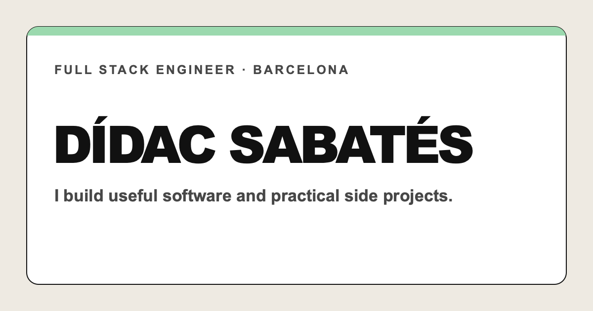
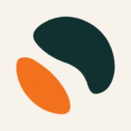
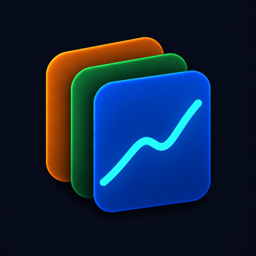
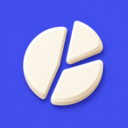
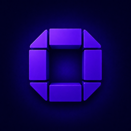

  

  
  
  
  

## Hey, I'm Dídac 👋

I'm a fullstack developer in Barcelona, currently working at [Pensero](https://pensero.ai). I have a habit of turning small everyday annoyances into focused apps, web tools, and hardware projects.

I like **local first software**, useful products with a small scope, ESP32 experiments, home automation, and 3D printing. I share the messy middle not just the launch on [X](https://x.com/didacsd) and [Instagram](https://www.instagram.com/didac.dev/).

> Follow along for prototypes, screenshots, tiny wins, failed experiments, and new things you can actually try.

## Featured apps

<table>
  <tr>
    <td width="50%" valign="top">
      <h3><a href="https://noff.app"> Noff</a></h3>
      
An intentional-disconnection app that puts the unlock action on a physical NFC tag.

      
<a href="https://apps.apple.com/app/noff/id6759967974"><strong>App Store ↗</strong></a> · <a href="https://noff.app">Website ↗</a>

    </td>
    <td width="50%" valign="top">
      <h3><a href="https://metricdeck.didac.dev"> MetricDeck</a></h3>
      
Private App Store analytics for downloads, revenue, refunds, and reviews.

      
<a href="https://apps.apple.com/nz/app/metricdeck-app-analytics/id6810206032"><strong>App Store ↗</strong></a> · <a href="https://metricdeck.didac.dev">Website ↗</a>

    </td>
  </tr>
  <tr>
    <td width="50%" valign="top">
      <h3><a href="https://didac.dev/projects/centim"> Cèntim</a></h3>
      
A local-first expense tracker that keeps your financial data on your iPhone.

      
<a href="https://apps.apple.com/do/app/c%C3%A8ntim-control-de-gastos/id6807595134"><strong>App Store ↗</strong></a> · <a href="https://didac.dev/projects/centim">Project page ↗</a>

    </td>
    <td width="50%" valign="top">
      <h3><a href="https://orka.didac.dev"> Orka</a></h3>
      
Native monitoring and management for self-hosted Coolify installations.

      
<a href="https://orka.didac.dev"><strong>Website ↗</strong></a>

    </td>
  </tr>
  <tr>
    <td width="50%" valign="top">
      <h3><a href="https://volum.didac.dev"> Volum</a></h3>
      
A free, open-source desktop organizer for STL, 3MF, OBJ, and STEP files.

      
<a href="https://volum.didac.dev"><strong>Download ↗</strong></a> · <a href="https://github.com/sabatesduran/volum">GitHub ↗</a>

    </td>
    <td width="50%" valign="top">
      <h3><a href="https://mimuu.app"> Mimuu</a></h3>
      
Shared gift lists that coordinate purchases without spoiling the surprise.

      
<a href="https://mimuu.app"><strong>Create a list ↗</strong></a>

    </td>
  </tr>
</table>

## More things I've made

### Apps

- [**Veura**](https://veura.app) — A private voice-to-text app for iPhone.
- [**NFC Studio**](https://nfcstudio.app) — NFC scan, write, and batch tools for iPhone.
- [**OC Remote**](https://ocremote.didac.dev) — Manage projects and follow OpenCode sessions from your iPhone.

### Web tools & games

- [**Orbites**](https://orbites.cat) — A game built for the web.
- [**CRACKD**](https://crackd.didac.dev) — A tactile logic puzzle about finding a hidden color code.
- [**Espía Gasolineras**](https://espiagasolineras.didac.dev) — Compare official fuel prices across Spain.
- [**hipotec.app**](https://hipotec.app) — A Spanish mortgage simulator.
- [**Eclipsi 2026**](https://eclipsi.didac.dev) — A local visibility guide for the total solar eclipse on 12 August 2026.
- [**G-code Viewer 3D**](https://gcodeviewer.didac.dev) — An interactive viewer for inspecting G-code toolpaths.
- [**StoreSnap**](https://storesnap.didac.dev) — A generator for polished App Store screenshots.
- [**QR Forge**](https://qrforge.didac.dev) — A free, straightforward QR code generator.
- [**Paelles**](https://paella.didac.dev) — A seafood paella ingredient calculator by pan size and servings.
- [**Juliana**](https://juliana.didac.dev) — A cocktail recipe calculator that scales ingredients by litres.

### On the workbench

- [**Bressol**](https://bressol.app) — A shared baby diary for feedings, diapers, and medication.
- [**Contraccions**](https://didac.dev/projects/contraccions) — A private contraction timer and hospital-plan utility for iPhone.
- [**OpenPrintCosts**](https://openprintcosts.com) — 3D-print job costing and quoting for makers and small workshops.

## Notes from the workshop

I write about the problems, prototypes, and wrong turns behind the finished projects:

- [**I connected my Withings Body+ to Home Assistant with an ESP32**](https://didac.dev/blog/i-made-my-withings-scale-sync-to-home-assistant-without-the-cloud)
- [**The app blocker I made because I kept cheating on Screen Time**](https://didac.dev/blog/the-app-blocker-i-made-because-i-kept-cheating-on-screen-time)
- [**How a bus queue became a BBK Live festival app**](https://didac.dev/blog/building-a-festival-companion-at-bbk-live)

[**Read the blog →**](https://didac.dev/blog)

## Tools I reach for

`Swift` · `SwiftUI` · `TypeScript` · `React` · `Next.js` · `Python` · `ESP32` · `ESPHome` · `Home Assistant` · `3D printing`

## Follow the next build

- [**X · @didacsd**](https://x.com/didacsd) — Short build logs, launches, and experiments.
- [**Instagram · @didac.dev**](https://www.instagram.com/didac.dev/) — Visual progress and behind-the-scenes builds.
- [**Printables · @didac**](https://www.printables.com/@didac) — 3D-printable models and workshop projects.
- [**MakerWorld · @sabatesduran**](https://makerworld.com/en/@sabatesduran) — 3D models, print profiles, and maker projects.
- [**didac.dev**](https://didac.dev) — Every app, article, build, and useful little tool in one place.

  <strong>If you like practical software and slightly unnecessary hardware projects, follow along.</strong> 
  <a href="https://x.com/didacsd">X</a> · <a href="https://www.instagram.com/didac.dev/">Instagram</a> · <a href="https://www.printables.com/@didac">Printables</a> · <a href="https://makerworld.com/en/@sabatesduran">MakerWorld</a> · <a href="mailto:hi@didac.dev">Say hello</a>

